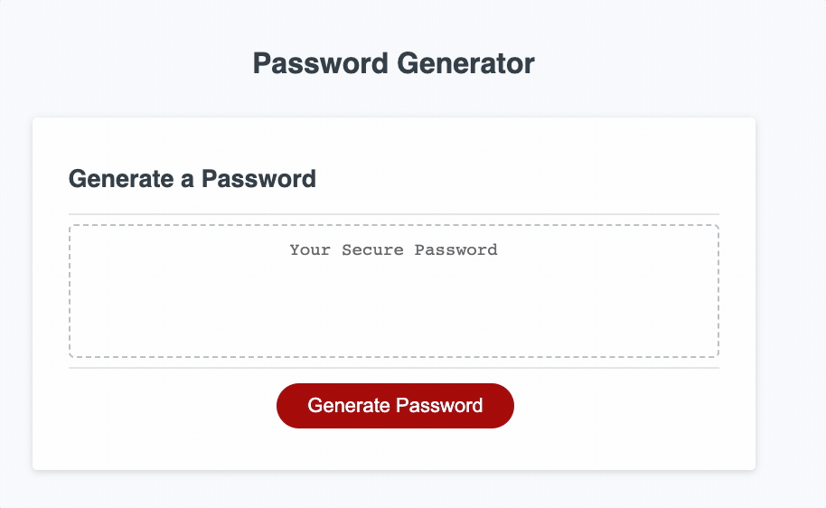

# password-generator

A password generator that can generate random passwords based on criteria that the user has selected

## Visit the Site

[Cleck Here to Visit the Deployed Site](https://ohsweetwampum.github.io/password-generator/)

## Description

## Technology Used

- JavaScript
  [Learn about Git](https://developer.mozilla.org/en-US/docs/Web/JavaScript)

- HTML
  [Learn about HTML](https://developer.mozilla.org/en-US/docs/Web/HTML)

- CSS
  [Learn about CSS](https://developer.mozilla.org/en-US/docs/Web/CSS)

- Git
  [Learn about Git](https://git-scm.com/)

## Usage

1.) Click red "Generate Password".
2.) Enter number between 8-128.
3.) Enter "yes" or "no" to having lower case letters included.
4.) Enter "yes" or "no" to having upper case letters included.
5.) Enter "yes" or "no" to having special characters included.
6.) Your password will show up in the text box!

## Learning Points

- Learned how to use functions in conjuction with else if statements, prompts, alerts
- Learned the importance of ensuring functions are actually called and not just defined
- Learned how to use empty variables to store user data that has been input
- Learned how to generate a random index
- Learned how to concatenate arrays
- Learned how to user a for loop to iterate a desired number of times

## Author Info

Matthew Gibson

- [Portfolio](https://github.com/ohSweetWampum)
- [LinkedIn](https://www.linkedin.com/in/matthew-gibson-6b9b12237/)
- [Github](https://github.com/ohSweetWampum)

## Credits

[meyerweb.com](https://meyerweb.com/eric/tools/css/reset/)
(For my reset.css file)

[w3schools.com](https://www.w3schools.com/js/js_array_methods.asp)
(array methods)

[w3schools.com](https://www.w3schools.com/js/js_if_else.asp)
(else if statements)

## License

---
